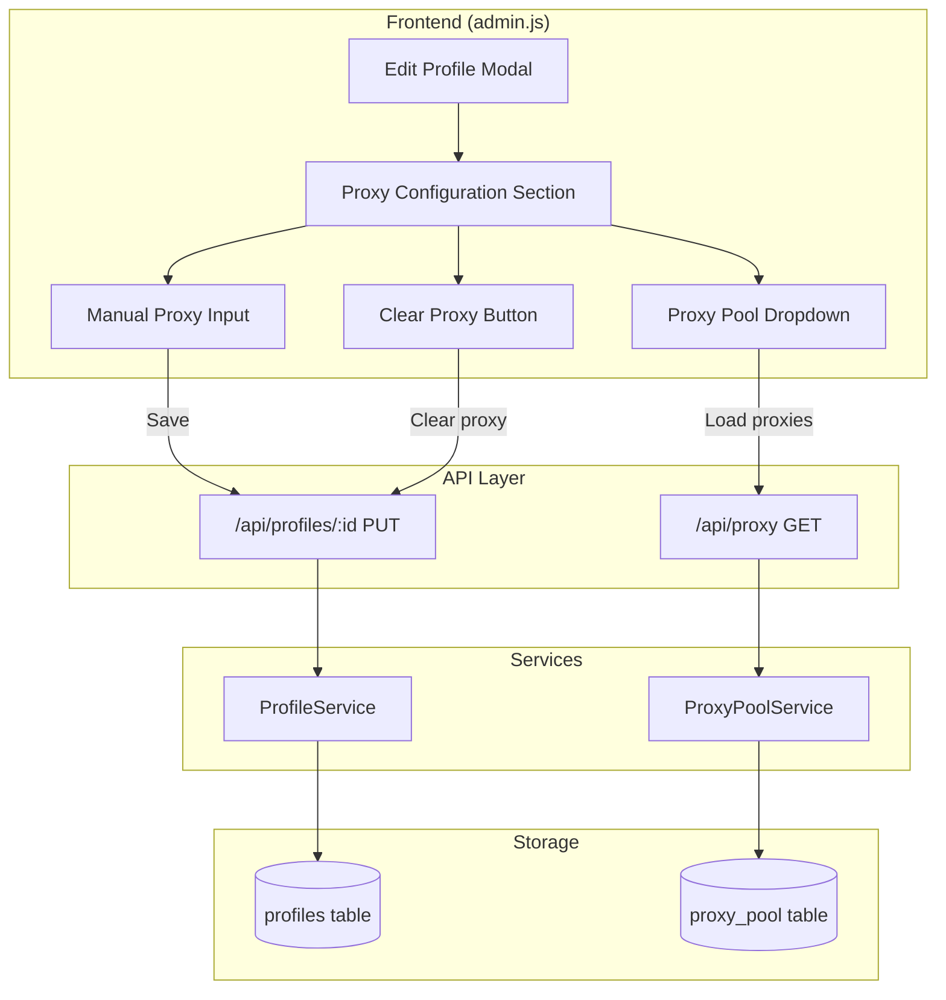

# Design Document: Profile Proxy Editor

## Overview

Tính năng này mở rộng Edit Profile Modal trong admin.html để cho phép người dùng cấu hình proxy trực tiếp trong giao diện chỉnh sửa profile. Thiết kế tận dụng cấu trúc hiện có của hệ thống bao gồm:
- ProxyPoolService để lấy danh sách proxy có sẵn
- ProfileService để cập nhật profile
- Validation middleware với Zod schema đã có sẵn cho proxy

## Architecture



## Components and Interfaces

### 1. Frontend Components

#### ProxyConfigSection (HTML trong Edit Profile Modal)
Thêm section mới vào Edit Profile Modal để cấu hình proxy:

```html
<!-- Proxy Configuration Section -->
<div class="card mt-3">
    <div class="card-header">
        <i class="fas fa-globe"></i> Proxy Configuration
    </div>
    <div class="card-body">
        <!-- Proxy Source Selection -->
        <div class="mb-3">
            <label class="form-label">Proxy Source</label>
            <select class="form-select" id="editProxySource">
                <option value="none">No Proxy</option>
                <option value="pool">Select from Proxy Pool</option>
                <option value="manual">Enter Manually</option>
            </select>
        </div>
        
        <!-- Proxy Pool Dropdown (shown when source = pool) -->
        <div id="proxyPoolSection" style="display: none;">
            <div class="mb-3">
                <label class="form-label">Select Proxy</label>
                <select class="form-select" id="editProxyPool">
                    <option value="">Loading proxies...</option>
                </select>
            </div>
        </div>
        
        <!-- Manual Proxy Input (shown when source = manual) -->
        <div id="manualProxySection" style="display: none;">
            <div class="row">
                <div class="col-md-6 mb-3">
                    <label class="form-label">Host *</label>
                    <input type="text" class="form-control" id="editProxyHost" placeholder="proxy.example.com">
                </div>
                <div class="col-md-3 mb-3">
                    <label class="form-label">Port *</label>
                    <input type="number" class="form-control" id="editProxyPort" placeholder="8080" min="1" max="65535">
                </div>
                <div class="col-md-3 mb-3">
                    <label class="form-label">Type</label>
                    <select class="form-select" id="editProxyType">
                        <option value="http">HTTP</option>
                        <option value="https">HTTPS</option>
                        <option value="socks4">SOCKS4</option>
                        <option value="socks5">SOCKS5</option>
                    </select>
                </div>
            </div>
            <div class="row">
                <div class="col-md-6 mb-3">
                    <label class="form-label">Username (optional)</label>
                    <input type="text" class="form-control" id="editProxyUsername" placeholder="username">
                </div>
                <div class="col-md-6 mb-3">
                    <label class="form-label">Password (optional)</label>
                    <input type="password" class="form-control" id="editProxyPassword" placeholder="password">
                </div>
            </div>
        </div>
        
        <!-- Current Proxy Display -->
        <div id="currentProxyInfo" class="alert alert-info" style="display: none;">
            <strong>Current Proxy:</strong> <span id="currentProxyText"></span>
        </div>
    </div>
</div>
```

#### JavaScript Functions (admin.js)

```javascript
// Load proxy pool for dropdown
async loadProxyPool() {
    const response = await fetch(`${this.baseUrl}/api/proxy`);
    const data = await response.json();
    return data.success ? data.data.filter(p => p.isActive !== false) : [];
}

// Handle proxy source change
handleProxySourceChange(source, profile) {
    // Show/hide appropriate sections based on source
}

// Build proxy object from form
buildProxyFromForm() {
    // Return proxy object or null
}

// Validate proxy configuration
validateProxyConfig(proxy) {
    // Return { valid: boolean, errors: string[] }
}
```

### 2. API Interface

API endpoint PUT /api/profiles/:id đã hỗ trợ cập nhật proxy thông qua updateProfileSchema trong validation.js:

```javascript
// Existing schema in middleware/validation.js
const proxyConfigSchema = z.object({
    host: z.string().min(1, 'Proxy host is required'),
    port: z.number().int().min(1).max(65535),
    type: z.enum(['http', 'https', 'socks4', 'socks5']).default('http'),
    username: z.string().optional(),
    password: z.string().optional()
}).optional();
```

Request body example:
```json
{
    "name": "Profile Name",
    "proxy": {
        "host": "proxy.example.com",
        "port": 8080,
        "type": "http",
        "username": "user",
        "password": "pass"
    }
}
```

Để xóa proxy:
```json
{
    "proxy": null
}
```

## Data Models

### Profile Proxy Object
```typescript
interface ProfileProxy {
    host: string;      // Required: proxy hostname or IP
    port: number;      // Required: 1-65535
    type: 'http' | 'https' | 'socks4' | 'socks5';  // Default: 'http'
    username?: string; // Optional: authentication username
    password?: string; // Optional: authentication password
}
```

### Proxy Pool Item (from API)
```typescript
interface ProxyPoolItem {
    id: string;
    host: string;
    port: number;
    type: string;
    country?: string;
    provider?: string;
    username?: string;
    password?: string;
    isActive: boolean;
    usageCount: number;
}
```


## Correctness Properties

*A property is a characteristic or behavior that should hold true across all valid executions of a system-essentially, a formal statement about what the system should do. Properties serve as the bridge between human-readable specifications and machine-verifiable correctness guarantees.*

### Property 1: Proxy Display Completeness
*For any* profile with a non-null proxy configuration, the profile details view SHALL display all proxy fields (host, port, type) and indicate authentication status (with/without credentials).
**Validates: Requirements 1.1**

### Property 2: Active Proxy Filtering
*For any* proxy pool containing both active and inactive proxies, the dropdown SHALL only display proxies where isActive is true.
**Validates: Requirements 2.4**

### Property 3: Proxy Selection Population
*For any* proxy selected from the dropdown, all form fields (host, port, type, username, password) SHALL be populated with the corresponding values from the selected proxy.
**Validates: Requirements 2.2**

### Property 4: Proxy Input Validation
*For any* proxy configuration input:
- Host must be a non-empty string (not whitespace-only)
- Port must be an integer between 1 and 65535
- Type must be one of: http, https, socks4, socks5
**Validates: Requirements 3.2, 3.3**

### Property 5: Authentication Consistency
*For any* proxy configuration:
- If username is provided and non-empty, password must also be provided
- If password is provided and non-empty, username must also be provided
- Both empty is valid (no authentication)
- Both provided is valid (with authentication)
**Validates: Requirements 3.5, 3.6**

### Property 6: Clear Proxy State Reset
*For any* profile with existing proxy configuration, clicking "Clear Proxy" SHALL result in all proxy form fields being empty and the proxy source being set to "none".
**Validates: Requirements 4.2**

### Property 7: Valid Proxy Save Round-Trip
*For any* valid proxy configuration (passing all validation rules), saving the profile and then reloading it SHALL return the same proxy configuration.
**Validates: Requirements 5.1, 6.1**

### Property 8: Invalid Proxy Rejection
*For any* invalid proxy configuration (failing validation rules), the API SHALL return HTTP 400 status and the profile's proxy SHALL remain unchanged.
**Validates: Requirements 5.2, 6.2**

### Property 9: Null Proxy Acceptance
*For any* profile, sending proxy: null to the API SHALL successfully remove the proxy configuration from the profile.
**Validates: Requirements 6.4**

## Error Handling

### Frontend Validation Errors
| Error Condition | User Message |
|----------------|--------------|
| Empty proxy host | "Proxy host is required" |
| Invalid port (< 1 or > 65535) | "Port must be between 1 and 65535" |
| Username without password | "Password is required when username is provided" |
| Password without username | "Username is required when password is provided" |

### API Errors
| HTTP Status | Condition | Response |
|-------------|-----------|----------|
| 400 | Invalid proxy data | `{ success: false, message: "Validation failed", errors: [...] }` |
| 404 | Profile not found | `{ success: false, message: "Profile not found" }` |
| 500 | Server error | `{ success: false, message: "Internal server error" }` |

## Testing Strategy

### Unit Tests
- Test proxy validation functions with specific examples
- Test proxy form field population
- Test proxy source toggle behavior
- Test clear proxy functionality

### Property-Based Tests
Using fast-check library (already in devDependencies):

1. **Proxy Validation Property Test**: Generate random proxy configurations and verify validation rules are consistently applied
2. **Active Proxy Filtering Test**: Generate random proxy pools and verify only active proxies appear in filtered list
3. **Round-Trip Property Test**: Generate valid proxy configs, save to API, reload, and verify equality
4. **Authentication Consistency Test**: Generate random username/password combinations and verify validation consistency

### Test Configuration
- Minimum 100 iterations per property test
- Use fast-check for property-based testing
- Tag format: **Feature: profile-proxy-editor, Property {number}: {property_text}**
